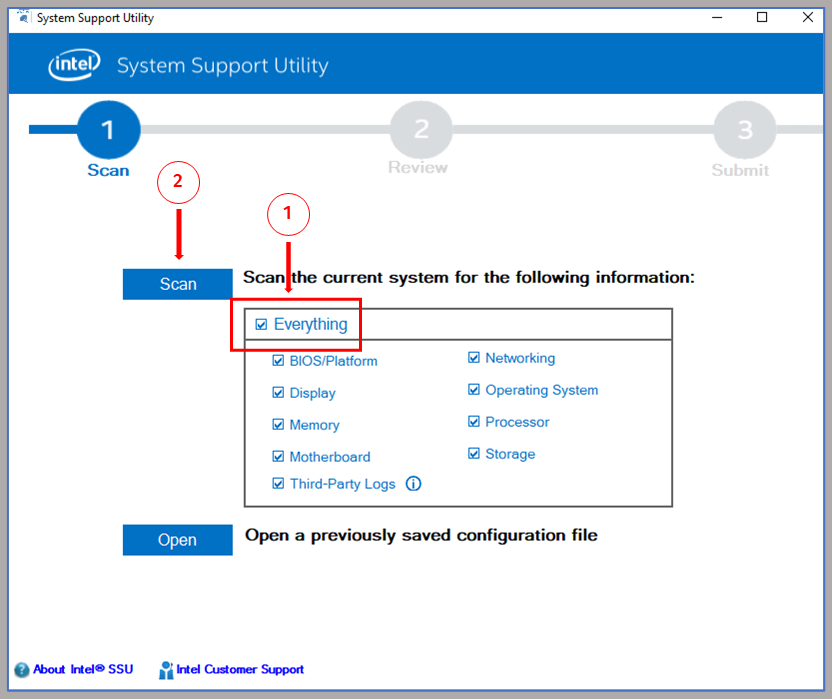
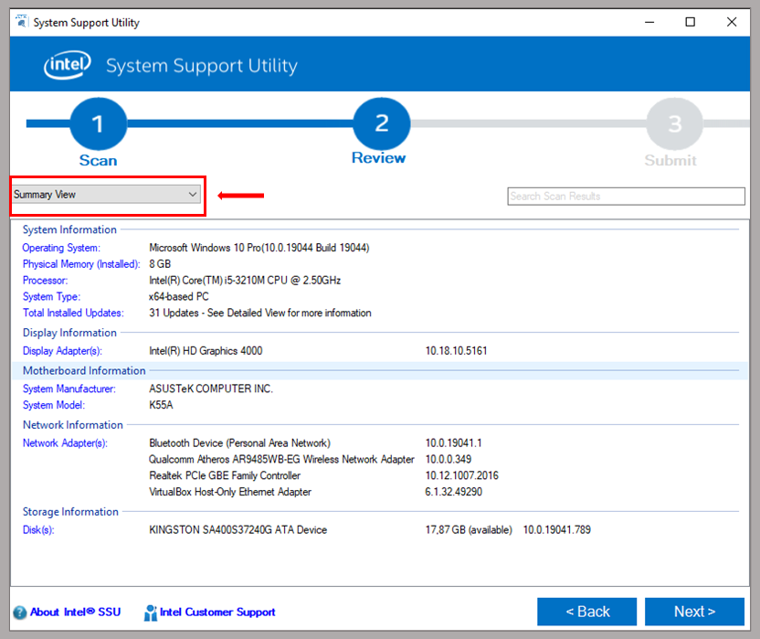

<!-- # Como as acessar as configurações detalhadas de hardware e software em desktops, notebooks/laptops e servidores no Windows® e em distros Linux baseadas em Debian -->

## WINDOWS^®^ (Vista/7/8/10/11/Server) {#sistema-operacional-windows}

Para acesso às informações do sistema incluindo os componentes físicos, aplicações e demais *software* utilizaremos a ferramenta ***Intel® System Support Utility (ISSU) for Windows***, que permite a geração de um relatório completo das configurações da máquina.

### Baixando e executando o ISSU {#parte-12-baixar-o-issu-e-executar-a-análise}

1)  Acesse o [link](https://github.com/webertsaturnino/tutoriais/raw/main/acesso-config-sistemas/apps/intel-ssu-windows.exe) e baixe o arquivo ***intel-ssu-windows.exe***;

2)  Execute o arquivo baixado (***intel-ssu-windows.exe***). Caso surja um diálogo do sistema com a mensagem "Deseja permitir que este aplicativo faça alterações no seu dispositivo?", clique em "Sim". Será aberta a janela do ***ISSU***. Marque a caixa de seleção ***Everything*** e depois no botão "***Scan***".

Feito isto, o ISSU realizará a detecção de todos os componentes do computador. Esta etapa pode demorar até 1min.

```{=html}
<figure>
  
  <figcaption>Fig. legenda.</figcaption>
</figure>
```
### Visualizando e exportando os resultados para um documento de texto (.***txt***) {#parte-22-visualizar-e-exportar-os-resultados}

3)  Após a execução da etapa anterios, a janela do ISSU será atualizada e exibirá um resumo da informações do sistema.

```{=html}
<figure>
  
  <figcaption>Fig. legenda.</figcaption>
</figure>
```
4)  No menu *dropdown* na parte superior esquerda da janela do *ISSU* estará selecionada a opção **Summary View**; Clicando neste menu haverá outra opção ***Detailed View***. Selecione-a para visualizar as configurações completas do computador.

```{=html}
<figure>
  
  <figcaption>Fig. legenda.</figcaption>
</figure>
```

5)  Para gerar um relatório completo das informações obtidas pelo **ISSU**, clique no botão "**Next>**", localizado no canto inferir direito da tela.

6)  A seguir, clique no botão "**Save**".

```{=html}
<figure>
  
  <figcaption>Fig. legenda.</figcaption>
</figure>
```
7.  Será aberta um diálogo padrão do Windows para salvar arquivos. Dê um nome ao arquivo que será salvo e escolha uma pasta de sua preferência. Por último clique em **"Salvar"**. Será gerado e salvo um arquivo de texto (*.txt*) contendo um relatório detalhado das informações da máquina.

------------------------------------------------------------------------

## LINUX (distros baseadas em Debian)

Para acesso às informações do sistema incluindo os componentes físicos, aplicações e demais *software* em distribuições Linux baseadas em Debian, incluso o próprio Debian, Ubuntu, Linux Mint, Pop!OS entre diversos outros, sugerimos a utilização do pacote ***lshw*** (*list hardware*). Este pacote de fácil utilização e se encontra nos repositórios oficiais do Debian e do Ubuntu. Possui versões também nos repositórios de outros projetos como o Mandriva, RedHat e OpenSUSE. Descreverems a seguir as etapas para instalação e e execução do *lshw* via terminal nas distribuições baseadas em Debian.

### Instalação e execução do pacote o ***lshw***:

Abra o terminal e execute:

1.  Para atualizar o índice de pacotes:

``` bash
sudo apt-get update
```

2.  Para instalar o lshw:

``` bash
sudo apt-get install lshw
```

3.  Para executar o lshw e visualizar as configurações:

``` bash
sudo lshw
```

<!-- img_begin{width="600"}img_end -->

```{=html}
<pre class="wiki" style="color:SlateBlue;background-color:LightGray">dell

    product: OptiPlex GXa 266L EM+
    vendor: Dell Computer Corporation
    serial: NL2SC
    capabilities: smbios-2.2 dmi-2.2
  *-core
     *-firmware

          description: BIOS
          vendor: Dell Computer Corporation
          version: A10 (06/23/00)
          size: 64KB
          capacity: 192KB
          capabilities: isa pci pnp apm upgrade shadowing escd cdboot bootselect edd int13floppytoshiba int13floppy360 int13floppy1200 int13floppy720 int13floppy2880 int5printscreen int9keyboard int14serial int17printer int10video
     *-cpu
          product: Pentium II (Klamath)
          vendor: GenuineIntel
          slot: Microprocessor
          size: 266MHz
          capacity: 333MHz
          clock: 66MHz
          capabilities: fpu fpu_exception wp vme de pse tsc msr pae mce cx8 sep mtrr pge mca cmov mmx
        *-cache:0
             description: Internal L1 Cache
             size: 32KB
             capacity: 32KB
        *-cache:1
             description: Pipeline burst Synchronous External L2 write-back Cache
             size: 512KB
             capacity: 512KB
     *-memory
          description: System Memory
          slot: System board or motherboard
          size: 192MB
          capacity: 384MB
        *-bank:0
             description: DIMM DRAM Synchronous 64 bits
             slot: DIMM_A
             size: 64MB
        *-bank:1
             description: DIMM DRAM Synchronous 64 bits
             slot: DIMM_B
             size: 64MB
        *-bank:2
             description: DIMM DRAM Synchronous 64 bits
             slot: DIMM_C
             size: 64MB
</pre>
```
### Exportando o relatório no formato *.html* como as configurações da máquina

``` bash
sudo lshw -html > /home/seu-usuario/nome-do-arquivo.html
```

```{=html}
<a href="files/lshw-saida-configuracoes.html">
<figure>
  
  <figcaption>Fig. legenda.</figcaption>
</figure>
</a>
```
A exportação no formato *.html* facilita a visualização e extração dos dados de interesse. No entanto é também possível exportação nos formatados de texto simples (*.txt*), XML (.xml) e JSON (.json), bastando substituir os parâmetros -html e a extensão .html

``` bash
sudo apt-get install lshw-gtk
```

``` bash
sudo lshw -X
```

A instalação do pacote lshw pode ser realizada pela central/loja de aplicativos de todas as distribuições atuais Linux basedas em Debian.
