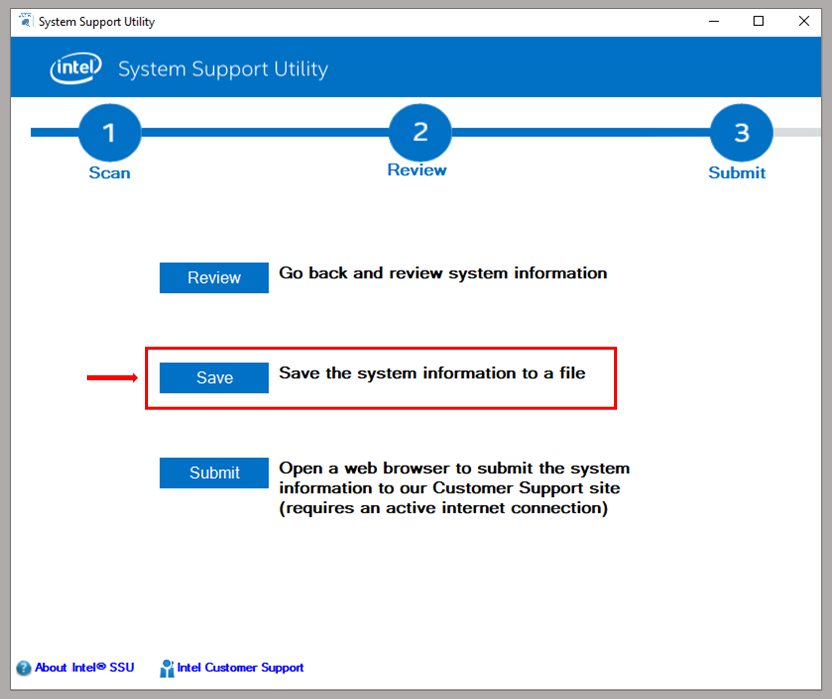
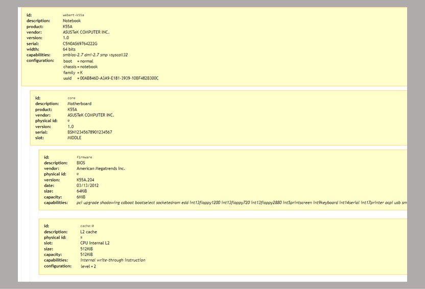
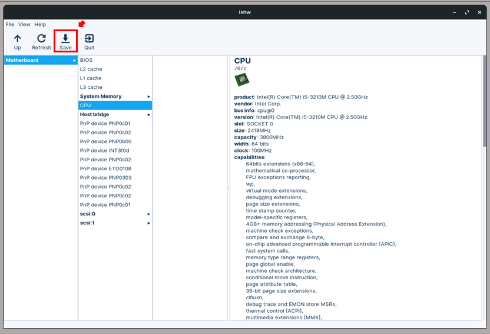

<hr style="height:2px;border-width:0;color:gray;background-color:gray">

## WINDOWS^®^ (Vista/7/8/10/11/Server) {#sistema-operacional-windows}

Para acesso às informações do sistema incluindo os componentes físicos, aplicações e demais *software* recomendamos a ferramenta ***Intel® System Support Utility (ISSU) for Windows***, que permite a geração de um relatório completo das configurações da máquina.

### Baixando e executando o *ISSU* {#parte-12-baixar-o-issu-e-executar-a-análise}

1)  Clique no botão abaixo e **salve** o arquivo ***intel-ssu-windows.zip*** no computador a ser analisado;


```{=html}
<figure>
  <a href="files/apps/intel-ssu-windows.zip">
  
  <figcaption style="font-size: small">Baixar Intel® SSU</figcaption>
  </a>
</figure>
```

2)  **Extraia** o arquivo ***intel-ssu-windows.zip*** para uma pasta de sua preferência***;***

3)  **Navegue até a pasta da extração e execute** o arquivo ***intel-ssu-windows.exe***. Será aberta a janela do ***ISSU***.

> *Caso nesta etapa apareça uma mensagem do sistema "Deseja permitir que este aplicativo faça alterações no seu dispositivo?", clique em "Sim".*

4)  Na janela inicial do ISSU, marque a caixa de seleção "***Everything***" e depois no botão "***Scan***".

O *ISSU* realizará a detecção de todos os componentes do computador. Esta etapa pode demorar até 1min.

```{=html}
<figure>
  
  <figcaption></figcaption>
</figure>
```
### Visualizando e exportando os resultados para um documento de texto (.***txt***) {#parte-22-visualizar-e-exportar-os-resultados}

5)  Após a execução da etapa anterios, a janela do ISSU será atualizada e exibirá um resumo da informações do sistema.

```{=html}
<figure>
  
  <figcaption></figcaption>
</figure>
```
6)  No menu *dropdown* na parte superior esquerda da janela do *ISSU* estará selecionada a opção **Summary View**; Clicando neste menu haverá outra opção ***Detailed View***. Selecione-a para visualizar as configurações completas do computador.

```{=html}
<figure>
  
  <figcaption></figcaption>
</figure>
```
7)  Para gerar um relatório completo das informações obtidas pelo **ISSU**, clique no botão "**Next>**", localizado no canto inferir direito da tela.

8)  A seguir, clique no botão "**Save**".

```{=html}
<figure>
  
  <figcaption></figcaption>
</figure>
```
9)  Será aberta um diálogo padrão do Windows para salvar arquivos. Dê um nome ao arquivo que será salvo e escolha uma pasta de sua preferência. Por último clique em **"Salvar"**. Será gerado e salvo um arquivo de texto (*.txt*) contendo um relatório detalhado das informações da máquina.

<hr style="height:2px;border-width:0;color:gray;background-color:gray">

## LINUX (distros baseadas em Debian)

> Para acesso às informações do sistema incluindo os componentes físicos, aplicações e demais *software* em distribuições Linux baseadas em Debian, incluso o próprio Debian, Ubuntu, Linux Mint, Pop!OS entre diversos outros, sugerimos a utilização do pacote ***lshw*** (*list hardware*). Este pacote de fácil utilização e se encontra nos repositórios oficiais do Debian e do Ubuntu. Possui versões também nos repositórios de outros projetos como o Mandriva, RedHat e OpenSUSE. Descreverems a seguir as etapas para instalação e e execução do *lshw* via terminal nas distribuições baseadas em Debian.

### Instalação e execução do pacote o ***lshw*** pelo terminal:

Abra o terminal e execute:

1.  Para atualizar o índice de pacotes:

``` bash
sudo apt-get update
```

2.  Para instalar o lshw:

``` bash
sudo apt-get install lshw
```

3.  Para executar o lshw e visualizar as configurações:

``` bash
sudo lshw
```

<!-- img_begin{width="600"}img_end -->

```{=html}
<pre class="wiki" style="color:SlateBlue;background-color:LightGray"> ASUS K55A
    description: Notebook
    product: K55A
    vendor: ASUSTeK COMPUTER INC.
    version: 1.0
    serial: XXXXXXXXXXXXXX
    width: 64 bits
    capabilities: smbios-2.7 dmi-2.7 smp vsyscall32
    configuration: boot=normal chassis=notebook family=K uuid=XXXXXXXXXXXXXXXXX
  *-core
       description: Motherboard
       product: K55A
       vendor: ASUSTeK COMPUTER INC.
       physical id: 0
       version: 1.0
       serial: BSN12345678901234567
       slot: MIDDLE
     *-firmware
          description: BIOS
          vendor: American Megatrends Inc.
          physical id: 0
          version: K55A.204
          date: 03/13/2012
          size: 64KiB
          capacity: 6MiB
          capabilities: pci upgrade shadowing cdboot bootselect socketedrom 
          edd int13floppy1200 int13floppy720 int13floppy2880 int5printscreen
          int9keyboard int14serial int17printer acpi usb smartbattery 
          biosbootspecification uefi
     *-cache:0
          [...]
     *-cache:1
           [...]
     *-cache:2
         [...]
     *-memory
          [...]
     *-cpu
          [...]
     *-pci
            [...]
         
        *-usb:0
             [...]
     
        *-communication
              [...]
              *-logicalvolume:1
              [...]
              *-logicalvolume:2
              [...]
</pre>
```
### Exportando o relatório no formato *.html* como as configurações da máquina

``` bash
sudo lshw -html > /home/seu-usuario/nome-do-arquivo.html
```

```{=html}
<a href="files/lshw-saida-configuracoes-k55a.html">
<figure>
  
  <figcaption>Clique na figura para ampliar</figcaption>
</figure>
</a>
```
> A exportação no formato *.html* facilita a visualização e extração dos dados de interesse. No entanto é também possível exportação nos formatados de texto simples (*.txt*), XML (.xml) e JSON (.json), bastando substituir os parâmetros -html e a extensão .html

### Instalação e execução do pacote o ***lshw*** pela interface gráfica:

Uma interface gráfica de usuário (GUI) está disponível para o pacote ***lshw*** e pode ser instalada e inicializada pelo terminal executando-se:

``` bash
sudo apt-get install lshw-gtk
sudo lshw -X
```

```{=html}
<style>
* {
  box-sizing: border-box;
}

.column {
  float: left;
  width: 50%;
  padding: 5px;
}

/* Clearfix (clear floats) */
.row::after {
  content: "";
  clear: both;
  display: table;
}
</style>
<div class="row">
  <div class="column">
    
  </div>
  <div class="column">
    
  </div>
</div>
```
Alternativamente, instalação do pacote ***lshw-gtk*** pode ser realizada pela central/loja de aplicativos de todas as distribuições atuais Linux basedas em Debian. Após a instalação basta buscar "lshw" no menu de aplicações da distribuição.
